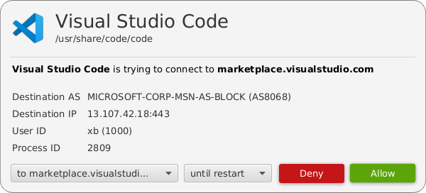

# AppFirewall FX UI

User interface for [AppFirewall](https://github.com/appfirewall/appfirewall) using JavaFX as view technology.

| WARNING: This is a prototype. |
| --- |

## User Interface

## What's missing?

- a lot.

## Compatibility

Compatible with (K/X)ubuntu 18.04.
Tray icon cannot be displayed on newer Gnome 3 based systems as they don't support legacy tray indicators anymore.

## Why Java/JavaFX?

It's pretty easy to create UIs with JavaFX.
Additionally, there is a hope to have a bit better UI perfomance than a python/QT-based implementation.

## Development
On (K/X)ubuntu 18.04, optimally [AppFirewall](https://github.com/appfirewall/appfirewall) is already installed.
Tray icon cannot be displayed on newer Gnome 3 based systems as they don't support legacy tray indicators anymore.

1. Install the OpenJDK 11: `sudo apt update && sudo apt install openjdk-11-jdk`
2. Install [IntelliJ IDEA Community Edition](https://www.jetbrains.com/idea/download/#section=linux)
3. Clone this project
4. Open this project in IntelliJ and let it import the gradle dependencies
5. Run `./gradlew run` in the Terminal and see if it works.

### Run

    ./gradlew run

    
### Create package

Creates a package with the necessary parts of the OpenJDK bundled.
See [Packaging](package/PACKAGING.md) for more information.

    ./gradlew clean createBundle -PjavaPackagerPath=/opt/jpackager-11

